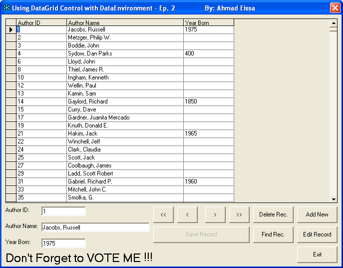



## Using DataGrid control with DataEnvironment EP2

### Description

Hi all, This is my next program about using DataGrid Control in viewing the data with DataEnvironment Control as Data Engine... but in this time I just add the buttons and some codes. nice and cool... :)
 
### More Info
 

             |
---                |---
**Submitted On**   |2006-02-01 05:30:04
**By**             |[Ahmad Eissa](https://github.com/Planet-Source-Code/PSCIndex/blob/master/ByAuthor/ahmad-eissa.md)
**Level**          |Advanced
**User Rating**    |4.5 (27 globes from 6 users)
**Compatibility**  |VB 6\.0
**Category**       |[Databases/ Data Access/ DAO/ ADO](https://github.com/Planet-Source-Code/PSCIndex/blob/master/ByCategory/databases-data-access-dao-ado__1-6.md)
**World**          |[Visual Basic](https://github.com/Planet-Source-Code/PSCIndex/blob/master/ByWorld/visual-basic.md)
**Archive File**   |[Using\_Data196927212006\.zip](https://github.com/Planet-Source-Code/ahmad-eissa-using-datagrid-control-with-dataenvironment-ep2__1-64193/archive/master.zip)

